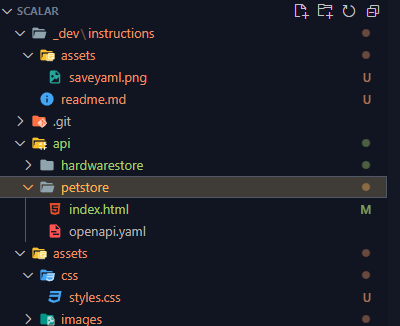
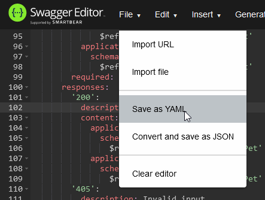

# Instructions

The following are the necessary steps to add a new API documentation page and link to the github pages site

## Add a link in the main index.html in the root of this project:
1. In the main index.html, find `<div class="w-md-75 container-fluid d-flex flex-wrap">` and duplicate the link div.

```
	<div class="col-sm-6 col-md-6 col-lg-4 mb-4">
	<a href="api/petstore/" class="api_card">
		<div class="text-center">
			<h5 class="mb-1 mt-2">Pet Store</h5>
			<p class="text-muted mb-3"><i>A public API for getting everything about your pet</i>
			</p>
		</div>
		<p class="text-muted">In nec rhoncus eros Vestibulum an mattis viverra sometimes magna
			nec pulvinar. Maecenas pellentesque porta auguesa consectetur facilisis diam poritor
			purus...
		</p>
		<div class="go-corner" href="#">
			<div class="go-arrow">
				→
			</div>
		</div>
	</a>
</div>
```
2. Replace `href="api/petstore/"` with the path to your api index.html and openapi.yaml folder, and edit the other information text fields according to your API.

## Add your API documentation source

1. Create a new folder inside the api folder and name it keeping in mind that the name will be used in the url (just name it as you would a slug string).
It should look something like this:
```
api
|-- petstore
```

2. Copy any existing index.html and api_main.js from another api in this project into the newly created folder.
```
api
|-- petstore
	|--index.html
	|--api_main.js
```

3. (optional) in index.html you can edit the **hideAllTry** and **pathArray** variables in order to:
**hideAllTry**: set **true** to hide all try/test request buttons
**pathArray**: add the paths of the api which you want to hide the try/test request button

```	
<script>
	// hide every try buttons if true
	const hideAllTry = true;

	// paths to hide the try button
	const pathArray = [
		'tag/pet/[put]/pet',
		'tag/pet/[post]/pet',
		'tag/pet/[post]/pet/{petId}/uploadImage'
	]

</script>
```

4. add your openapi.yaml documentation file. Using swagger editor or simply exporting from the framework (depends on framework), rename it to openapi.yaml and save it to your API documentation folder.
```
api
|-- petstore
	|--index.html
	|--api_main.js
	|--openapi.yaml
```


**Note:** you may also use json format, but you must change the extension of the file loaded at index.html `data-url="openapi.yaml"` to `data-url="openapi.json"`

## Create API documentation
If you cannot export the api documentation directly from your project, then you most likely need to write it yourself. To write API documentation you can use Swagger - editor to edit and preview in the browser, when you're finished just go to the top bar and click Save as YAML.
[LINK Swagger-Editor](https://editor.swagger.io/)
</br>
</br>
